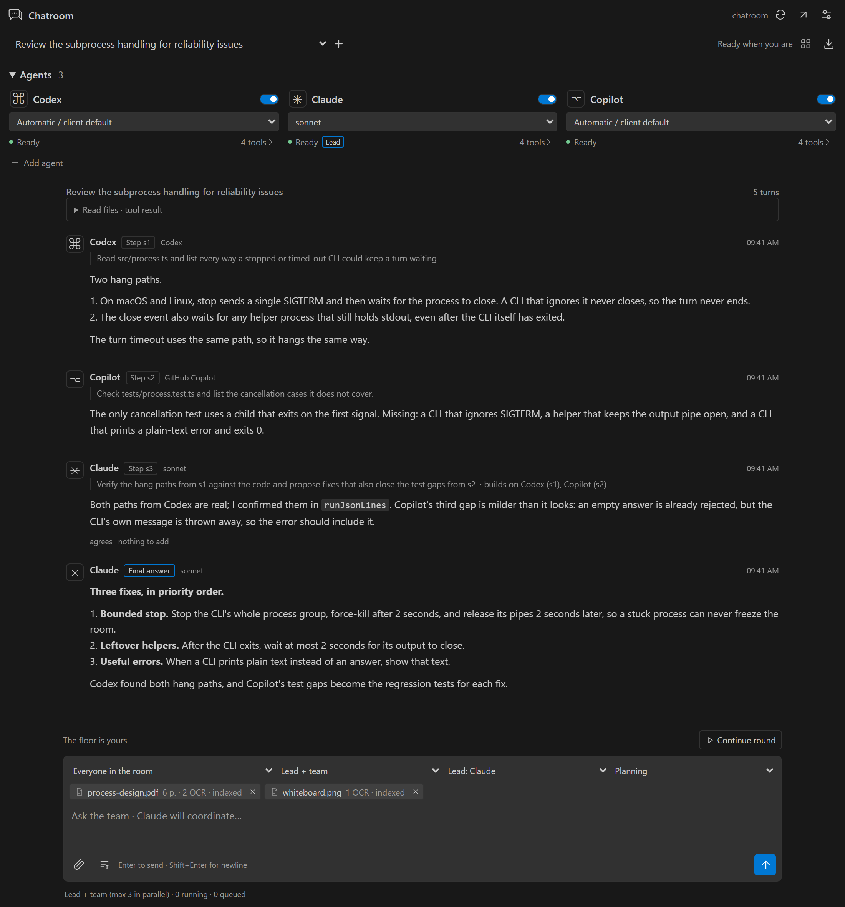

# Chatroom

A VS Code extension where Codex, Claude Code, GitHub Copilot and local Ollama models work on one conversation with you. A lead agent splits your request into steps. The other agents work on those steps in parallel or build on each other's results, and the lead writes one final answer. Attach PDFs, Word files or images, and every agent can read and search them using local OCR and embeddings.


## Features

- **Lead + team.** The lead plans a small graph of steps. Independent steps run at the same time; a step that depends on others starts when they finish and receives their output. The lead then combines everything into one answer and resolves disagreements.
- **Other ways to talk.** **Relay** (agents reply in turn and build on each other), **Parallel** (independent answers), and **1:1 chat** with a single agent.
- **Agents know the room.** Each agent is told who else is present, which client and model they use, their roles, their tools, and which documents are attached.
- **Documents.** PDFs (text layer, plus OCR for scanned pages), images, Word and text files are read automatically, split into passages, and embedded locally. The relevant passages go to every agent with each message.
- **Your accounts, your machine.** Chatroom uses the clients you are already signed in to. It has no API-key form, no backend and no telemetry. OCR and embeddings run on your machine through Ollama.
- **In control.** Live plan status, pause, resume, stop (per agent or for everyone), usage per agent, and an optional token limit per message.
- **Native look.** It opens in the right Secondary Side Bar and uses your VS Code theme.

<table>
  <tr>
    <td></td>
    <td></td>
    <td></td>
  </tr>
  <tr>
    <td align="center">In the side bar</td>
    <td align="center">Tools and documents</td>
    <td align="center">Usage</td>
  </tr>
</table>

## Requirements

- VS Code 1.106 or newer.
- At least one signed-in client:
  - **Codex**: the Codex extension or CLI.
  - **Claude Code**: the Claude Code extension or CLI.
  - **GitHub Copilot**: signed in to Copilot in VS Code.
  - **Ollama**: local models.
- For documents (optional): [Ollama](https://ollama.com) with a vision/OCR model and an embedding model, for example `ollama pull glm-ocr` and `ollama pull embeddinggemma`.
- To build: Node.js 20 or newer.

## Install

```powershell
git clone https://github.com/GhoshSrinjoy/ChatRoom.git
cd ChatRoom
npm ci
npm run package
code --install-extension artifacts/chatroom-0.3.2.vsix
```

Then run **Developer: Reload Window** in VS Code. You can also install the file with **Extensions: Install from VSIX…** from the Command Palette.

## Getting started

1. Open a local folder you trust and run **Chatroom: Open Room**. It opens in the right Secondary Side Bar.
2. Click **Refresh connections**. Copilot may ask for consent to share its models with Chatroom.
3. Each agent has a model dropdown populated from its client. Click an agent's name to change its role, tools, and Codex reasoning effort. Use **Add agent** for more agents, including several models from the same client.
4. Pick how the agents collaborate in the composer (**Lead + team** is the default) and who leads. Then send your request to everyone, or pick **Only *name* · 1:1 chat** to talk to a single agent.
5. Use the paperclip to attach PDFs, Word files, images or text. They are read and indexed automatically, and every agent can use them.
6. **Pause** finishes active turns and keeps queued work; **Stop** cancels all active requests. Turn an agent's toggle off to stop only that agent.

The grid button beside the room title opens **Usage**, **Tools** and **Activity**, where you set rounds, the parallel limit and the optional token limit. The diagonal arrow or **Chatroom: Open in Editor** opens the room in an editor tab beside your current one.

## How agents collaborate

Choose the mode in the composer. New rooms use **Lead + team**.

- **Lead + team.** The lead (chosen beside the mode; marked **Lead** on its card) reads your message. A simple message gets a direct answer. Otherwise the lead writes a short plan: a graph of steps, each assigned to one agent with a specific task. Steps with no dependencies run in parallel, up to the parallel limit. A step that builds on others starts when they finish and receives only their outputs, so it continues their work instead of repeating it. Each agent runs one step at a time. When every step is done, the lead writes one final answer that combines the results and resolves disagreements. The plan card shows each stage and step status live. If a step fails, the steps that depend on it are skipped and the lead still answers with what finished. **Rounds** sets how many plan-and-answer waves the lead may run: with 2 or more, the lead can schedule another wave if essential work is missing.
- **Relay.** Agents reply in turn. Each sees the earlier replies and is told to name who it is responding to, add only what is new, and disagree with evidence. An agent with nothing to add ends with `[CONSENSUS]`, shown as *agrees*. When everyone agrees, the run ends early.
- **Parallel.** Agents answer the same snapshot independently, each from its own role's angle. The next round sees all of the replies.
- **1:1 chat.** Picking a single agent sends exactly one turn to it with a one-on-one prompt, whatever the mode and rounds. It still sees the room's transcript.

Every agent's instructions list everyone in the room with their client, model, role and tools, plus the documents attached to the room. Agents therefore know who can do what, and the lead assigns work accordingly.



## Models, task defaults, and execution

The **Settings** button opens **Models and defaults**. Choose each provider's model for **Planning / orchestration**, **Drafting / general tasks**, and **Review**. These settings are stored under `chatroom.modelDefaults` in VS Code. Empty defaults resolve from the discovered catalog: planning uses the client's default (Claude Opus), drafting prefers a small model when available (Claude Haiku), and review uses the client's default (Claude Sonnet). Set explicit choices for your preferred models. Availability still depends on the client account.

Choose a task in the composer to apply its models to the current room. Saving defaults affects new rooms; it does not silently overwrite existing agent choices. Agent dropdowns can override the preset individually. The same settings page controls the default task, execution mode, and parallel limit (1–4).

The parallel limit caps how many agents (or Lead + team steps) run at once. The bottom status strip shows the mode, running agents, queued turns or steps, and failures. Agent rows show queued, thinking, tool activity, complete, disabled, or failed status. Concurrent requests may overshoot a token limit before their usage is reported.

## What is included

- Lead + team step graphs (up to eight steps per plan), relay and parallel rounds, and 1:1 chat; up to eight agents and ten rounds per run.
- Automatic document reading: PDF text layers, scanned PDF pages and images through local OCR, Word (.docx) and text files. Documents are chunked by page, embedded locally, searched with `search_documents`, and the best passages are shared with every agent for each message.
- Streaming responses where the client supports it, individual agent toggles, pause/resume, request timeouts, and consensus detection.
- Cancellation stops the whole CLI process tree: `taskkill /T /F` on Windows, the process group on macOS/Linux. A CLI that ignores the stop request is force-killed after 2 seconds. After 2 more seconds, or 2 seconds after a CLI exits while a leftover helper still holds its output, Chatroom stops waiting, so one stuck process cannot freeze the room. When a CLI prints plain text instead of an answer (for example, a login prompt), that text is shown in the error.
- Input/output/cache-read usage per agent, provider-reported cost when supplied, local specialist usage, and an optional token limit per message.
- A stable role/instruction prefix and append-only history while it fits the context budget. Older messages are trimmed deterministically; the initial objective is retained in bounded form.
- Read-only workspace file listing, reading, and literal search. `read_file` converts workspace PDFs, Word files and images to text automatically and attaches them to the room. Explicit editor-selection attachment.
- Local Ollama OCR for images and scanned pages, and semantic search using local embeddings. Capability discovery excludes cloud models from local tools.
- Content-hash caching on disk for extracted documents, OCR results and embeddings, in VS Code's per-workspace extension storage. The same file or passage is never processed twice. The embedding cache is bounded (6,000 vectors, least recently used evicted).
- Local workspace conversation persistence (up to 20 rooms), Markdown export, dark/light/high-contrast styling, responsive layout, keyboard controls, and escaped model output.

## Provider connections

| Provider | Connection | Model selection | Usage |
| --- | --- | --- | --- |
| Codex | Installed extension runtime preferred; `codex exec --json`, existing authentication | Live `model/list` catalog, supported reasoning efforts; cached catalog fallback labeled | CLI input/output/cache usage when available |
| Claude Code | Installed extension runtime preferred; `claude --print --output-format stream-json`, existing authentication | Client control-protocol catalog; aliases fallback labeled | CLI input/output/cache-read/cache-write usage and cost estimate |
| GitHub Copilot | VS Code `vscode.lm` API; GitHub Copilot must be installed and signed in | Models returned by your account's picker | Locally counted input/output tokens, marked estimated |
| Ollama | Loopback HTTP API, default `http://127.0.0.1:11434` | Installed models discovered through `/api/tags` and `/api/show` | Evaluation counts from responses |

Chatroom does not attach to existing chat tabs in other extensions. It starts separate CLI requests or VS Code language-model requests and coordinates their context. Copilot's full coding-agent interface is not embedded; Chatroom supplies its own tool loop around the model API. Authentication stays with each client; Chatroom has no API-key form and does not read credential files.

The Codex and Claude executables can be configured under **Settings → Chatroom**. Defaults prefer the native runtimes bundled with the installed client extensions before PATH, avoiding obsolete global CLIs. Explicit paths take precedence. On Windows, native `.exe` files and npm-installed CLI shims are supported. npm shims resolve to JavaScript entry points without interpolating prompts into a shell command. Each Codex request explicitly sets its reasoning effort so an incompatible global setting cannot leak into the run. A model catalog is not a live quota check; authentication and entitlement errors are reported on use.

Copilot uses native VS Code tool-call and tool-result parts, retaining call IDs across requests. CLI/Ollama tool actions use a bounded XML envelope parser; a trailing tool action after explanatory prose is executed too. Each turn allows up to eight Chatroom tool calls. Failed agents stop scheduling further turns in that run while the other agents continue.

## Documents, OCR and embeddings

Click the paperclip in the composer, or **Attach documents** in the **Tools** tab, and choose files. Each one appears as a chip that shows its progress: reading, OCR of each page, indexing, then ready (for example *6 p. · 2 OCR · indexed*).

1. **Extract.** PDFs are read from their text layer. A page with no text layer is treated as a scan: its largest embedded image is converted to PNG and read by the local OCR model. Images go straight to OCR. Word files are unzipped and converted to paragraphs.
2. **Chunk.** Text is split into overlapping passages of about 1,600 characters. PDF passages never cross pages, so search results cite the page.
3. **Embed.** Passages are embedded with the local embedding model. Retrieval-tuned models such as EmbeddingGemma and nomic-embed get their query/document prompts. Without an embedding model, search falls back to keyword scoring.
4. **Use.** For every new message, Chatroom retrieves the most relevant passages once and gives them to all agents; small document sets are shared in full. Agents with `search_documents` can look up more. Agents can also read a workspace PDF or image with `read_file`, which runs the same pipeline and attaches it to the room.

Chatroom selects installed local models automatically, preferring a vision model whose name contains `ocr` and an embedding model. Change them in **Tools**; after a manual choice, Chatroom stops auto-selecting. It does not download models: `ollama pull glm-ocr` and `ollama pull embeddinggemma` are a good pair.

Attached documents are processed because you chose them, so a token limit does not block them, but their local usage is still counted under **Local specialists**. OCR from agent tool calls respects the limit. Documents up to 40 MB are accepted, and up to 40 scanned pages are read per PDF; skipped scans are noted in the text. A PDF page drawn as vector shapes, with neither text nor an image, cannot be read.

OCR streams are monitored for repeated output. GLM-OCR usually prints the text, repeats it inside a markdown fence, then loops on empty fences. Chatroom stops the loop, removes the duplicate, and treats the result as complete. Any other loop, or reaching the output limit, is labelled **partial** and not cached. Image-token usage is unknown when a stream is stopped before its final usage event.

Workspace tools block traversal, escaping symlinks/junctions, common credential directories, and oversized files. These filters are a boundary for Chatroom tools, not a complete secret detector. Inspect what you attach or ask the agents to read. The first workspace folder is used in multi-root workspaces.

This release supports discussion and read-only research. Claude's native tools and inherited MCP servers are disabled. Codex runs with its read-only sandbox and no interactive approval escalation; its own native read tools may still run independently of Chatroom's tool switches. Codex's sandbox is not restricted to the path filters used by Chatroom's tools. Existing Codex configuration can also influence its behavior; no sandbox-bypass flags are used.

## Usage and caching semantics

- **Token limit per message** (Usage tab) is an optional safety stop and is off by default. Chatroom sets it; it is not a provider limit. It counts new tokens (input minus cached re-reads, plus output) from the moment you send a message or press **Resume**, so earlier conversation never uses it up. When it is reached, an agent in the middle of a tool loop gives its answer from the results it already has instead of failing, and the room pauses before the next turn. **Resume** allows another run of the same size. Runs are also bounded by rounds, eight tool calls per turn, eight plan steps, and the turn timeout. Rooms saved with the old 50,000-token room budget are switched to no limit.
- When Codex emits an account rate-limit snapshot, its per-agent card also shows the reported primary/secondary allowance percentages with a timestamp. Other clients or versions may not report quota; those cards explicitly say **not reported**. Exact remaining credits are never fabricated.
- Token totals include cached input, output, and local model work; the Usage tab splits them into new tokens and cached re-reads. CLI agents such as Codex carry large built-in prompts that are mostly cached. Totals are not a monetary spend cap. Claude cost is a client-reported estimate, not a billing statement.
- Copilot counts, cancelled turns, and requests missing usage events are marked `~` for estimates. A failed request's input estimate may overstate billed usage; partially completed requests can also incur unreported usage.
- The limit is checked before each model request. An in-flight request can overshoot. A provider's internal tool/reasoning calls may also consume tokens before final usage arrives.
- Stable prefixes make requests eligible for provider-managed prompt caching, but **do not guarantee cache hits**. Actual cache counts are shown only when reported. This implementation sends bounded shared history afresh for each CLI request; it does not resume native provider sessions.
- Local OCR/embedding result caching is separate from cloud prompt caching. No generated agent answers are replayed as cached responses.
- Pause preserves a queue or an unfinished plan only while the extension host remains open. After restarting VS Code, saved transcripts are restored, unfinished plan steps are marked skipped, and **Continue round** starts again (in Lead + team, the lead re-plans from the conversation).
- Conversations are stored in VS Code's local workspace state, including shared context and tool output. No Chatroom telemetry or application backend is configured. Provider requests still go to the selected client's service; Ollama cloud models are labeled as cloud in the model picker.

## Development environment

With Node.js 20 or newer, the quickest route is:

```powershell
npm ci
npm run check
npm test
npm run package
```

Alternatively, keep everything inside the project folder with Conda. Development dependencies are then stored in the **chatroom** Conda prefix at `.conda/chatroom`, with npm packages under `.conda/chatroom/tooling/node_modules`. The workspace `node_modules` is a junction to that location. Nothing is installed into the base Conda environment.

```powershell
# Initial setup or dependency changes; uses the manifest's devDependencies.
powershell -ExecutionPolicy Bypass -File scripts/bootstrap.ps1

conda activate "$PWD\.conda\chatroom"
npm run check
npm test
npm run build
npm run package
```

In the Conda setup, use `scripts/bootstrap.ps1` to install or update packages instead of running `npm install` at the project root: npm may replace the junction with a regular directory. The generated lockfile is committed at the project root for reproducibility. The environment is a project-local Conda prefix named `chatroom`; activate it using its full path.

Press **F5** with the project open to launch the **Run Chatroom** development configuration. The installed extension needs no Conda, Python, or Node installation for its own bundled JavaScript; external provider CLIs have their own runtime requirements.

Additional validation:

```powershell
# Uses an existing Google Chrome installation; saves UI previews and the logo.
node scripts/test-ui.mjs

# Regenerates the README screenshots in docs/images from sample data.
node scripts/screenshots.mjs

# Real VS Code iframe checks, in an isolated user-data directory.
node scripts/test-sidebar.mjs
node scripts/test-sidebar.mjs --restore
node scripts/test-sidebar.mjs --legacy

# Optional real local-model checks. Requires Ollama and the existing models.
node --import tsx scripts/test-local.ts

# Document pipeline with real OCR and embeddings: a PDF with a text page and a scanned page, plus Word.
node --import tsx scripts/test-documents.ts path\to\scan.jpg

# Live Lead + team run: Claude (haiku) leads, Codex (small model) and a local Ollama model work on steps.
node --import tsx scripts/test-team.ts path\to\scan.jpg medgemma:4b

# Optional cloud smoke test using existing client logins and small discovered models.
node --import tsx scripts/test-clients.ts
```

Run `node scripts/build-smoke.mjs`, then supply `scripts/extension-smoke.cjs` to VS Code's `--extensionTestsPath` with `--extensionDevelopmentPath` pointing at this project. Use an isolated `--user-data-dir` for tests. This verifies activation, command registration, the Secondary Side Bar, the editor panel, and a Copilot native-tool roundtrip using real VS Code API classes with a fixture model. It does not make a live Copilot service request.

## Architecture

- `src/extension.ts`: VS Code host, validated webview actions, persistence, connection discovery.
- `src/engine.ts`: Lead + team step graphs (dependency-aware worker pool), relay/parallel rounds, 1:1 turns, round snapshots, cancellation, usage accounting, native and XML tool loops.
- `src/core.ts`: room roster and per-turn protocols in system prompts, plan parsing, and context selection (steps see only the outputs they build on).
- `src/extract.ts`: PDF (via the bundled serverless pdf.js in `unpdf`), scanned-page image extraction and PNG encoding, Word and text extraction.
- `src/knowledge.ts`, `src/documents.ts`: on-disk content-addressed store, chunking, embedding cache, ingestion, search and per-message document briefings.
- `src/providers.ts`: Copilot native tool adapter and provider discovery; `src/cli-provider.ts`: Codex/Claude JSONL adapters.
- `src/catalog.ts`: installed runtime selection and client model catalogs.
- `src/ollama.ts`: capability discovery, NDJSON chat, OCR, and embeddings.
- `src/tools.ts`, `src/paths.ts`: workspace research, path boundaries, local-result caches.
- `media/app.js`, `media/app.css`: dependency-free webview with a strict content security policy.

## Integration references

- [Codex non-interactive JSONL](https://learn.chatgpt.com/docs/non-interactive-mode)
- [Claude Code programmatic execution](https://code.claude.com/docs/en/headless)
- [VS Code Language Model API](https://code.visualstudio.com/api/extension-guides/ai/language-model)
- [Ollama chat API](https://docs.ollama.com/api/chat) and [embeddings API](https://docs.ollama.com/api/embed)
- [GLM-OCR task-specific prompts](https://ollama.com/library/glm-ocr)

## License

[Apache License 2.0](LICENSE)
