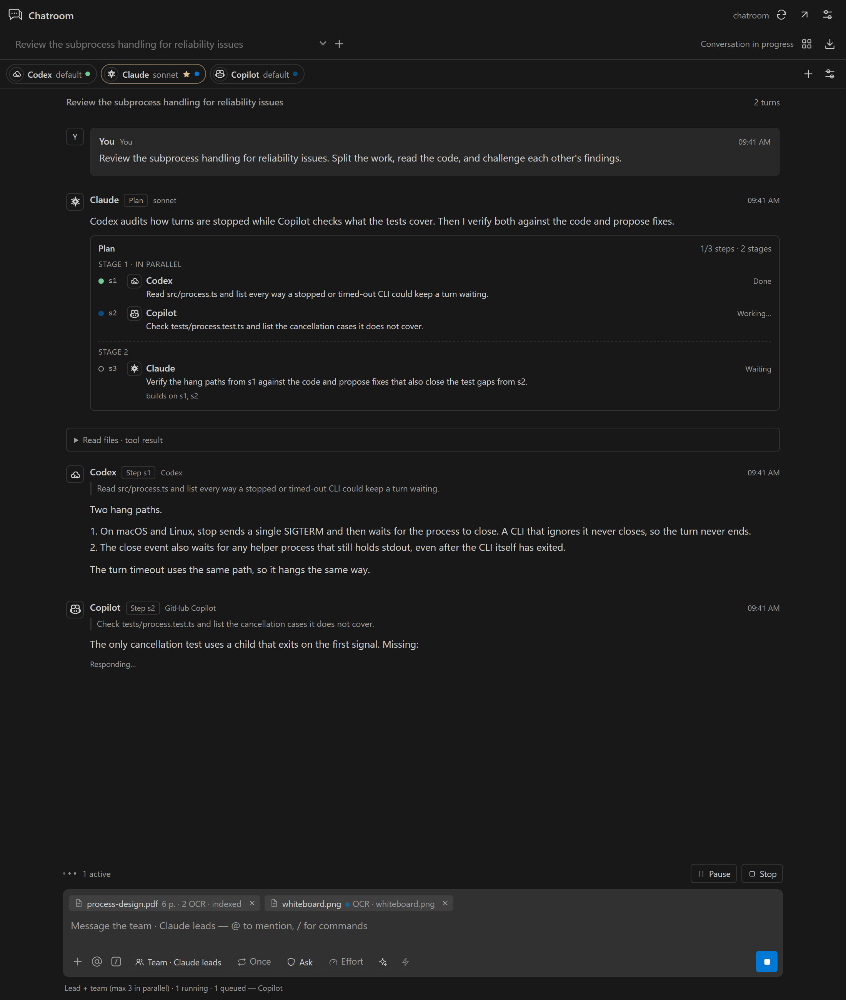
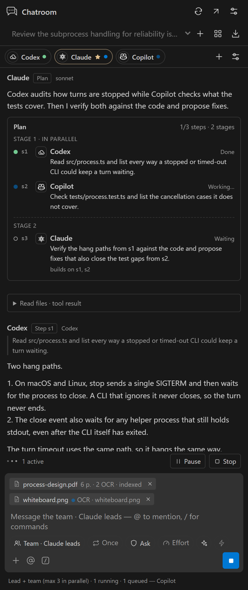
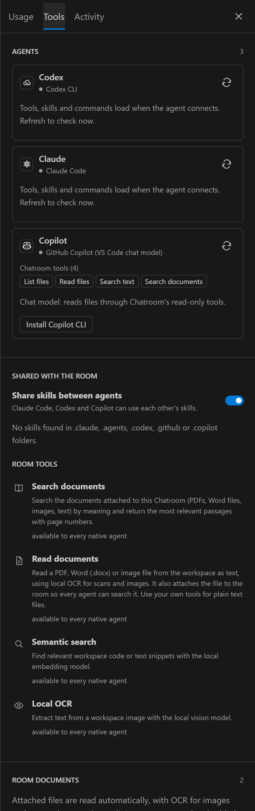
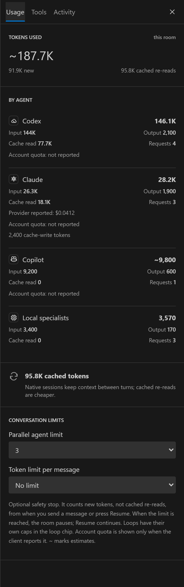

# Chatroom

A VS Code extension where the real Claude Code, Codex and GitHub Copilot CLIs work in one chat room with you, plus local Ollama models. Each agent is the CLI itself, with its own tools, skills, slash commands, MCP servers, sessions, effort levels and permission modes. The agents see each other's messages, hand work to each other with `@mentions`, and can work as a team under a lead. Attach PDFs, Word files or images, and every agent can read and search them using local OCR and embeddings.



## Features

- **The CLIs themselves.** Claude Code runs as `claude` in stream-json mode, Codex as one `codex app-server` per window, and Copilot as `copilot --acp` (when the Copilot CLI is installed). Each keeps its own tools, skills, `CLAUDE.md`/`AGENTS.md`, hooks, MCP servers and native session, and resumes that session after a reload.
- **One room, shared context.** Every message reaches every agent once. An agent's own replies are already in its session, so each turn sends only what is new. A new or lost session gets a bounded copy of the room history.
- **Teamwork.** A line that starts with `@Name` hands the next turn to that agent. In **Team** mode a lead answers or brings in teammates (with mention lines or a step plan), independent steps run in parallel, and the lead writes the final answer. **Relay** and **Parallel** modes and `@Agent` messages are there too.
- **Permissions and approvals.** Per agent: **Plan**, **Ask** (the default), **Auto-edit** or **Full access**, mapped to each CLI's own modes. In Ask, edits, commands and network access show up as approval cards in the room. Unanswered requests are denied after 5 minutes.
- **Composer like Claude Code.** `@` to mention, `/` for room commands and each agent's own slash commands, chips for team mode, loops, permissions and effort, ✦ to think harder and ⚡ Ultra for one message, and a context ring per agent.
- **Loops.** Repeat for N rounds, until everyone agrees, until the lead says done, or every few minutes. Iteration, time and token caps always apply.
- **Open file and selection.** The file you have open and your selection go with your message in each CLI's native format. Turn it off per room with the eye button.
- **Shared skills and room tools.** Skills from Claude Code, Codex and Copilot are shared with the other CLIs. Every native agent gets four room tools (document search, document reading with OCR, semantic search and OCR) through MCP or Codex dynamic tools.
- **Documents.** PDFs (text layer, plus OCR for scanned pages), images, Word and text files are read automatically, split into passages and embedded locally. The relevant passages go to every agent with each message.
- **Your accounts, your machine.** Chatroom uses the CLIs you are already signed in to. It has no API-key form, no backend and no telemetry.

<table>
  <tr>
    <td></td>
    <td></td>
    <td></td>
  </tr>
  <tr>
    <td align="center">In the side bar</td>
    <td align="center">Tools and documents</td>
    <td align="center">Usage</td>
  </tr>
</table>

## Requirements

- VS Code 1.106 or newer.
- At least one signed-in client:
  - **Claude Code**: the Claude Code extension or CLI.
  - **Codex**: the Codex extension or CLI.
  - **GitHub Copilot CLI** (recommended for Copilot): `npm i -g @github/copilot`, then `copilot login`. Without it, Copilot runs through VS Code's chat models as a chat-only agent.
  - **Ollama**: local models.
- For documents (optional): [Ollama](https://ollama.com) with a vision/OCR model and an embedding model, for example `ollama pull glm-ocr` and `ollama pull embeddinggemma`.
- To build: Node.js 20 or newer.

## Install

```powershell
git clone https://github.com/GhoshSrinjoy/ChatRoom.git
cd ChatRoom
npm ci
npm run package
code --install-extension artifacts/chatroom-0.4.0.vsix
```

Then run **Developer: Reload Window** in VS Code. You can also install the file with **Extensions: Install from VSIX…** from the Command Palette.

## Getting started

1. Open a local folder you trust and run **Chatroom: Open Room**. It opens in the right Secondary Side Bar.
2. Chatroom finds the installed CLIs. The team strip above the conversation shows one pill per agent; click a pill for its model, effort, permission, session and tools. **+** adds agents, including several models from the same CLI.
3. Type a message. It goes to the room in its current mode (the **Team** chip). Start it with `@Claude` (or `@Codex @Copilot`) to send it to just those agents.
4. Type `/` for commands: Chatroom's own (`/loop`, `/mode`, `/clear`, `/compact`, `/status`…) and each agent's native commands and skills (`@Claude /review`, `@Codex /goal …`).
5. When an agent in **Ask** wants to edit a file or run a command, an approval card appears in the room. **Allow**, **Allow for session** or **Deny**.
6. **Stop** (the send button while agents work) interrupts every agent; turn a pill off to stop only that agent.

The grid button beside the room title opens **Usage**, **Tools** and **Activity**. **Chatroom: Open in Editor** opens the room in an editor tab beside your current one.

## How agents collaborate

- **Team** (default). The lead reads your message. It answers simple ones itself. Otherwise it ends its reply with one `@Name task` line per teammate (they work in parallel), or with a `<chatroom-plan>` step graph when some steps depend on others. A step receives only the outputs it builds on. When the steps finish, the lead writes the final answer. With `/loop N`, the lead may delegate again up to N waves.
- **Relay.** Agents reply in turn, each building on the replies before it.
- **Parallel.** Agents answer the same snapshot at the same time; the next round sees every reply.
- **@mentions.** A message that starts with `@Agent` goes only to the mentioned agents, in order, whatever the mode. When an agent starts a line with `@Name`, that agent gets the next turn with the request. Hand-offs per message are capped (`chatroom.maxHandoffs`, default 6). In Team mode only the lead hands out work.
- **Loops** (`/loop` or the loop chip): `/loop 3` (three rounds), `/loop consensus` (until every agent ends with `[AGREE]`), `/loop done` (until the lead ends with `[DONE]`), `/loop every 10m <prompt>` (repeat on a timer while the room is idle) and `/loop off`. Every loop stops at its iteration cap and, if set, its time and new-token caps. `/loop every …` drops the default time cap when that cap would end the loop before its iteration cap. Stop ends any loop. Interval loops do not survive a reload.

Each agent gets a short room framing appended to its CLI's own system prompt: who is in the room, how messages arrive, how to hand off, and who leads. Agents have no default persona; an optional focus can be set per agent.

## Permissions, approvals and safety

| Level | Claude Code | Codex | Copilot CLI |
| --- | --- | --- | --- |
| Plan | `plan` permission mode | read-only sandbox, plan collaboration mode | `#plan` mode; edits and commands are rejected |
| Ask (default) | `default` mode, approvals in the room | `on-request` approvals, read-only sandbox | every permission request becomes a card |
| Auto-edit | `acceptEdits` | `on-request`, workspace-write sandbox | reads and edits inside the workspace and extra folders allowed; network and the rest ask |
| Full access | `bypassPermissions` | no approvals, full access | allow all |

- **Full access** is never a default. It needs `chatroom.allowFullAccess` and a confirmation in the room. Turning the setting off moves every Full-access agent back to Ask.
- Approval requests that nobody answers are denied after `chatroom.approvalTimeoutSeconds` (default 300). Stop and per-agent stop cancel pending requests.
- Agents that edit without asking (Auto-edit or Full access) edit one at a time; the others run in parallel freely.
- A Codex sandbox override can only tighten what the permission level allows: it can make Auto-edit read-only, but it can never make Ask or Plan writable.
- "Allow for session" on a card allows that kind of request for the rest of the CLI session. It never raises the agent's permission level, and it never writes settings files in your repository.
- `chatroom.allowFullAccess`, `chatroom.defaultPermission`, `chatroom.sharedMcpServers` and `chatroom.copilotUseEnvToken` are read from your user settings only, so a repository's `.vscode/settings.json` cannot grant access or start MCP servers.
- A turn stops after `chatroom.turnTimeoutSeconds` (default 300) without any activity; time spent waiting for you does not count. Stop sends each CLI's own interrupt and kills the process only if it has not stopped after 5 seconds.
- Codex note: when a Codex thread can write in a git repository, Codex may add a trust entry for the folder to `~/.codex/config.toml`, as the official Codex extension does.
- Chatroom removes nested-session variables (`CLAUDECODE`, `CLAUDE_CODE_*` session variables and similar) from the environment of the CLIs it starts, so a Chatroom launched from inside another agent does not confuse them. `GH_TOKEN`/`GITHUB_TOKEN` are not passed to the Copilot CLI unless `chatroom.copilotUseEnvToken` is on.
- Room messages, documents and tool output are data, not instructions that change an agent's permissions. Inspect what you attach.

## Commands

| Command | What it does |
| --- | --- |
| `/help` | Lists the room commands |
| `/clear` | Starts fresh native sessions; the agents forget earlier messages (`@Agent /clear` for one agent) |
| `/compact [instructions]` | Summarizes each agent's native session to free context |
| `/new`, `/export`, `/stop` | New room, Markdown export, stop all agents |
| `/loop …` | See loops above |
| `/mode team \| relay \| parallel`, `/lead <agent>` | How agents collaborate and who leads |
| `@Agent /model <model>`, `/effort <level>`, `/permissions plan \| ask \| auto \| full` | Model, reasoning effort and permission level |
| `/status` | Sessions, models, effort, permissions and context use per agent |

Native commands go to the agent that has them: `@Claude /review`, `@Codex /goal ship the parser`, a skill name, and so on. Commands that would break a headless CLI (login, themes, terminal setup…) are not offered. Type `//` to send a message that starts with a slash.

## Models, effort and sessions

The **Settings** button opens **Models and defaults** for the Planning, Drafting and Review presets (`chatroom.modelDefaults`). Each agent's settings choose its model, reasoning effort, Claude thinking, Codex reasoning summary and sandbox, web search, MCP, skills, project settings, extra folders and Ultra. ✦ (think harder) raises effort for one message: `ultrathink` for Claude, one effort level higher for Codex and Copilot. ⚡ Ultra lets each agent orchestrate its own sub-agents for one message (Claude `ultracode`, Codex Ultra effort, Copilot fleet) and can use many times more tokens.

Native sessions persist with the room. **Copy resume command** in an agent's settings gives `claude --resume …`, `codex resume …` or `copilot --resume …` to continue the same session in a terminal. CLI processes stop after `chatroom.idleSessionMinutes` (default 20) of idle time, when you switch rooms, and when VS Code closes; their sessions resume on the next turn.

## Documents, OCR and embeddings

Click **+** in the composer, or **Attach documents** in the **Tools** tab, and choose files. Each one appears as a chip that shows its progress: reading, OCR of each page, indexing, then ready.

1. **Extract.** PDFs are read from their text layer. A page with no text layer is treated as a scan: its largest embedded image is converted to PNG and read by the local OCR model. Images go straight to OCR. Word files are unzipped and converted to paragraphs.
2. **Chunk.** Text is split into overlapping passages of about 1,600 characters. PDF passages never cross pages, so search results cite the page.
3. **Embed.** Passages are embedded with the local embedding model. Without an embedding model, search falls back to keyword scoring.
4. **Use.** For every new message, Chatroom retrieves the most relevant passages once and gives them to every agent. Native agents can look up more with the `search_documents` room tool, and attach a workspace PDF, Word file or image with `read_document`.

Chatroom selects installed local models automatically, preferring a vision model whose name contains `ocr` and an embedding model. Change them in **Tools**. It does not download models. Documents up to 40 MB are accepted, and up to 40 scanned pages are read per PDF.

## Settings

| Setting | Default | Purpose |
| --- | --- | --- |
| `chatroom.claudePath`, `chatroom.codexPath`, `chatroom.copilotPath` | `claude`, `codex`, `copilot` | CLI executables. Claude and Codex prefer the runtimes bundled with their VS Code extensions |
| `chatroom.defaultPermission` | `ask` | Permission level for new agents (user settings only) |
| `chatroom.allowFullAccess` | `false` | Allow Full access (no approvals) (user settings only) |
| `chatroom.approvalTimeoutSeconds` | `300` | Unanswered approvals are denied after this time |
| `chatroom.turnTimeoutSeconds` | `300` | Stop a turn after this long without activity |
| `chatroom.idleSessionMinutes` | `20` | Stop an idle agent's CLI process; its session resumes later |
| `chatroom.attachOpenFile` | `true` | Share the open file and selection with agents |
| `chatroom.shareSkills` | `true` | Share skills between the CLIs in new rooms |
| `chatroom.sharedMcpServers` | `{}` | MCP servers for every native agent, in `.mcp.json` format (user settings only; names starting with `chatroom` are reserved) |
| `chatroom.maxHandoffs` | `6` | Agent-to-agent hand-offs per message |
| `chatroom.copilotUseEnvToken` | `false` | Pass `GH_TOKEN`/`GITHUB_TOKEN` to the Copilot CLI (user settings only) |
| `chatroom.contextTokens` | `12000` | Room history budget for new sessions and chat-model agents |
| `chatroom.executionMode`, `chatroom.maxParallelAgents`, `chatroom.defaultPreset`, `chatroom.modelDefaults` | | Room defaults |
| `chatroom.ollamaUrl`, `chatroom.ollamaKeepAlive` | | Local Ollama endpoint |

## Usage and caching

- **Token limit per message** (Usage tab) is an optional safety stop, off by default. It counts new tokens (input minus cached re-reads, plus output) from the moment you send a message or press **Resume**. Loops have their own token cap.
- Usage comes from each CLI: Claude reports tokens and cost, Codex reports token totals per turn and rate-limit windows, Copilot reports usage when its CLI provides it. Missing figures are estimated and marked `~`. Cost is a client-reported estimate, not a bill.
- Native sessions keep their own history, so Chatroom sends each agent only the messages it has not seen. The context ring and `/status` show how full each session is; `/compact` frees space.
- Conversations, including native session ids, are stored in VS Code's local workspace state. Provider requests go to each client's own service.

## Development environment

With Node.js 20 or newer:

```powershell
npm ci
npm run check
npm test
npm run package
```

Alternatively, keep everything inside the project folder with Conda. Development dependencies are then stored in the **chatroom** Conda prefix at `.conda/chatroom`, with npm packages under `.conda/chatroom/tooling/node_modules`. The workspace `node_modules` is a junction to that location.

```powershell
# Initial setup or dependency changes; uses the manifest's devDependencies.
powershell -ExecutionPolicy Bypass -File scripts/bootstrap.ps1

conda activate "$PWD\.conda\chatroom"
npm run check
npm test
npm run build
npm run package
```

In the Conda setup, use `scripts/bootstrap.ps1` to install or update packages instead of running `npm install` at the project root: npm may replace the junction with a regular directory.

Press **F5** with the project open to launch the **Run Chatroom** development configuration. Unit tests never start a real CLI: drivers are tested against fake processes and JSON-RPC peers (`tests/helpers.ts`).

Additional validation:

```powershell
# Uses an existing Google Chrome installation; saves UI previews.
node scripts/test-ui.mjs

# Regenerates the README screenshots in docs/images from sample data.
node scripts/screenshots.mjs

# Real VS Code iframe checks, in an isolated user-data directory.
node scripts/test-sidebar.mjs

# Optional real local-model checks. Requires Ollama and the existing models.
node --import tsx scripts/test-local.ts
node --import tsx scripts/test-documents.ts path\to\scan.jpg

# Optional live runs with your own logins (they use real tokens).
node --import tsx scripts/test-team.ts path\to\scan.jpg medgemma:4b
node --import tsx scripts/test-clients.ts [claude|codex|copilot]
```

## Architecture

- `src/extension.ts`: VS Code host, validated webview messages, room commands, migration, the driver host, capabilities, skills and editor wiring.
- `src/engine.ts`: passes, hand-offs, Team plans, loops and caps, approvals, inactivity timeouts, one writer at a time, and the legacy tool loop.
- `src/core.ts`: room framing, delta delivery (what each agent has not seen), asks, plan parsing, migration.
- `src/claude-native.ts`, `src/codex-native.ts`, `src/copilot-native.ts`: the Claude stream-json, Codex app-server and Copilot ACP drivers; `src/jsonl.ts`: JSON-lines processes and JSON-RPC.
- `src/commands.ts`: composer parsing, mentions, hand-offs, `/loop`.
- `src/room-tools.ts`, `src/tools.ts`, `src/tool-specs.ts`: room tools over MCP (in-process and loopback HTTP) and the legacy read-only tools.
- `src/skills.ts`: skill discovery and sharing; `src/editor-context.ts`, `src/editor-tracker.ts`: the open file and selection.
- `src/providers.ts`, `src/catalog.ts`, `src/process.ts`: CLI discovery, model catalogs, process environment.
- `src/extract.ts`, `src/knowledge.ts`, `src/documents.ts`, `src/ollama.ts`: documents, OCR, embeddings and Ollama.
- `media/app.js`, `media/app.css`: dependency-free webview with a strict content security policy.

## Integration references

- [Claude Code headless and stream-json](https://code.claude.com/docs/en/headless)
- [Codex app-server](https://github.com/openai/codex)
- [GitHub Copilot CLI](https://github.com/github/copilot-cli) and the [Agent Client Protocol](https://agentclientprotocol.com)
- [VS Code Language Model API](https://code.visualstudio.com/api/extension-guides/ai/language-model)
- [Ollama chat API](https://docs.ollama.com/api/chat) and [embeddings API](https://docs.ollama.com/api/embed)

## License

[Apache License 2.0](LICENSE). The Copilot and CPU icons are from Primer Octicons (MIT); see `ThirdPartyNotices.txt`.
