# Chatroom

[](https://github.com/GhoshSrinjoy/ChatRoom/releases/latest) [](https://github.com/GhoshSrinjoy/ChatRoom/actions/workflows/release.yml) [](LICENSE)

A VS Code extension where the real Claude Code, Codex and GitHub Copilot CLIs work in one chat room with you, plus local Ollama models. Each agent is the CLI itself, with its own tools, skills, slash commands, MCP servers, sessions, effort levels and permission modes. The agents see each other's messages, hand work to each other with `@mentions`, and can work as a team under a lead. Attach PDFs, Word files or images, and every agent can read and search them using local OCR and embeddings.

<p align="center"><br><em>Team mode. Claude leads: Codex and Copilot take two steps in parallel, Claude checks both against the code, then writes the final answer.</em></p>

## Features

- **The CLIs themselves.** Claude Code runs as `claude` in stream-json mode, Codex as one `codex app-server` per window, and Copilot as `copilot --acp` (when the Copilot CLI is installed). Each keeps its own tools, skills, `CLAUDE.md`/`AGENTS.md`, hooks, MCP servers and native session, and resumes that session after a reload.
- **One room, shared context.** Every message reaches every agent once. An agent's own replies are already in its session, so each turn sends only what is new. A new or lost session gets a bounded copy of the room history.
- **Teamwork.** A line that starts with `@Name` hands the next turn to that agent. In **Team** mode a lead answers or brings in teammates (with mention lines or a step plan), independent steps run in parallel, and the lead writes the final answer. **Relay** and **Parallel** modes and `@Agent` messages are there too.
- **Your own team.** Set up stages that run in order, such as **Leads → Drafting → Review → Testing → Coding**, with one or more agents per stage, an optional task and model routing. Use the team builder, the `chatroom.teams` setting or `/team`.
- **Sandbox (optional).** Agents or you can run code, tests or security checks in a throwaway Docker container on a copy of the folder, with no network unless you allow it. Every run asks you first.
- **Worktrees (optional).** Agents that edit at the same time each get their own git worktree and branch; the room combines their work and you review, apply, keep or discard it.
- **Keeps going when an agent can't.** An agent that is out of usage, not installed, signed out, on a model that isn't available, or offline (Ollama) is shown as such and skipped. The others continue, and another agent takes its step or stage.
- **Permissions and approvals.** Per agent: **Plan**, **Ask** (the default), **Auto-edit** or **Full access**, mapped to each CLI's own modes. In Ask, edits, commands and network access show up as approval cards in the room. Unanswered requests are denied after 5 minutes.
- **Composer like Claude Code.** `@` to mention, `/` for room commands and each agent's own slash commands, chips for team mode, loops, permissions and effort, ✦ to think harder and ⚡ Ultra for one message, and a context ring per agent.
- **Loops.** Repeat for N rounds, until everyone agrees, until the lead says done, or every few minutes. Iteration, time and token caps always apply.
- **Open file and selection.** The file you have open and your selection go with your message in each CLI's native format. Turn it off per room with the eye button.
- **Shared skills and room tools.** Skills from Claude Code, Codex and Copilot are shared with the other CLIs. Every native agent gets four room tools (document search, document reading with OCR, semantic search and OCR) through MCP or Codex dynamic tools.
- **Documents.** PDFs (text layer, plus OCR for scanned pages), images, Word and text files are read automatically, split into passages and embedded locally. The relevant passages go to every agent with each message.
- **Your accounts, your machine.** Chatroom uses the CLIs you are already signed in to. It has no API-key form, no backend and no telemetry.


## Requirements

- VS Code 1.106 or newer.
- At least one signed-in client:
  - **Claude Code**: the Claude Code extension or CLI.
  - **Codex**: the Codex extension or CLI.
  - **GitHub Copilot CLI** (recommended for Copilot): `npm i -g @github/copilot`, then `copilot login` (or run **Chatroom: Sign in to Copilot CLI**). Without it, Copilot runs through VS Code's chat models as a chat-only agent.
  - **Ollama**: local models.
- For documents (optional): [Ollama](https://ollama.com) with a vision/OCR model and an embedding model, for example `ollama pull glm-ocr` and `ollama pull embeddinggemma`.
- For the [sandbox](#sandbox-optional) (optional): Docker Desktop (Windows, macOS) or Docker Engine (Linux).
- For [worktrees](#worktrees-optional) (optional): a git repository; git 2.38 or newer applies changes most reliably.
- To build from source: Node.js 20 or newer.

## Install

**From a release (recommended)**

1. Download `chatroom-<version>.vsix` from the [latest release](https://github.com/GhoshSrinjoy/ChatRoom/releases/latest).
2. In VS Code, open the Command Palette and run **Extensions: Install from VSIX…**, then pick the file. From a terminal: `code --install-extension chatroom-<version>.vsix`.
3. Run **Developer: Reload Window**, then **Chatroom: Open Room**.

To update, install the newer `.vsix` the same way and reload. Your rooms and settings are kept.

**From source**

```powershell
git clone https://github.com/GhoshSrinjoy/ChatRoom.git
cd ChatRoom
npm ci
npm run package
```

`npm run package` type-checks, builds and writes `artifacts/chatroom-<version>.vsix`. Install it as above, or with `code --install-extension artifacts/chatroom-<version>.vsix`.

## Getting started

1. Open a local folder you trust and run **Chatroom: Open Room**. It opens in the right Secondary Side Bar.
2. Chatroom finds the installed CLIs. The team strip above the conversation shows one pill per agent; click a pill for its model, effort, permission, session and tools. **+** adds agents, including several models from the same CLI.
3. Type a message. It goes to the room in its current mode (the **Team** chip). Start it with `@Claude` (or `@Codex @Copilot`) to send it to just those agents.
4. Type `/` for commands: Chatroom's own (`/loop`, `/mode`, `/clear`, `/compact`, `/status`…) and each agent's native commands and skills (`@Claude /review`, `@Codex /goal …`).
5. When an agent in **Ask** wants to edit a file or run a command, an approval card appears in the room. **Allow**, **Allow for session** or **Deny**.
6. **Stop** (the send button while agents work) interrupts every agent; turn a pill off to stop only that agent.

The grid button beside the room title opens **Usage**, **Tools** and **Activity**. **Chatroom: Open in Editor** opens the room in an editor tab beside your current one.

<table>
  <tr>
    <td align="center" width="50%"><br><em>The room in the side bar. Each agent is a pill in the team strip (★ marks the lead). The composer's chips set the team, loop, permissions and effort.</em></td>
    <td align="center" width="50%">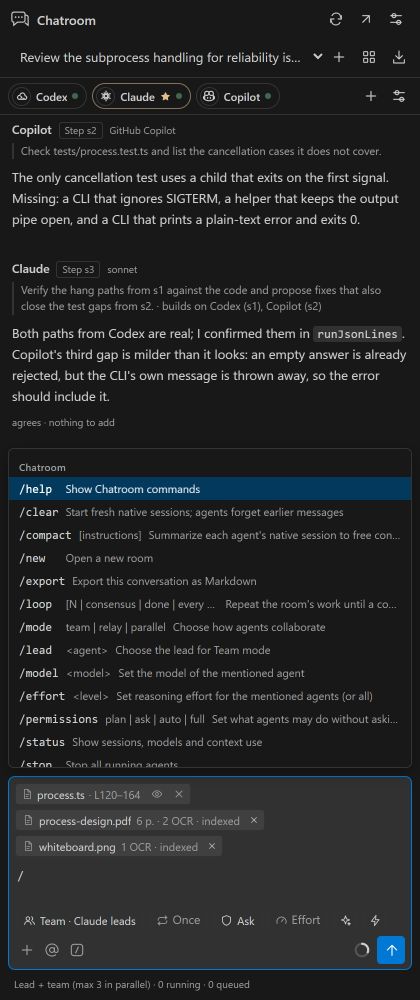<br><em>Type <code>/</code> for Chatroom's commands and each agent's own commands and skills. The open file and your selection go along as a chip; the eye turns it off.</em></td>
  </tr>
</table>

<p align="center">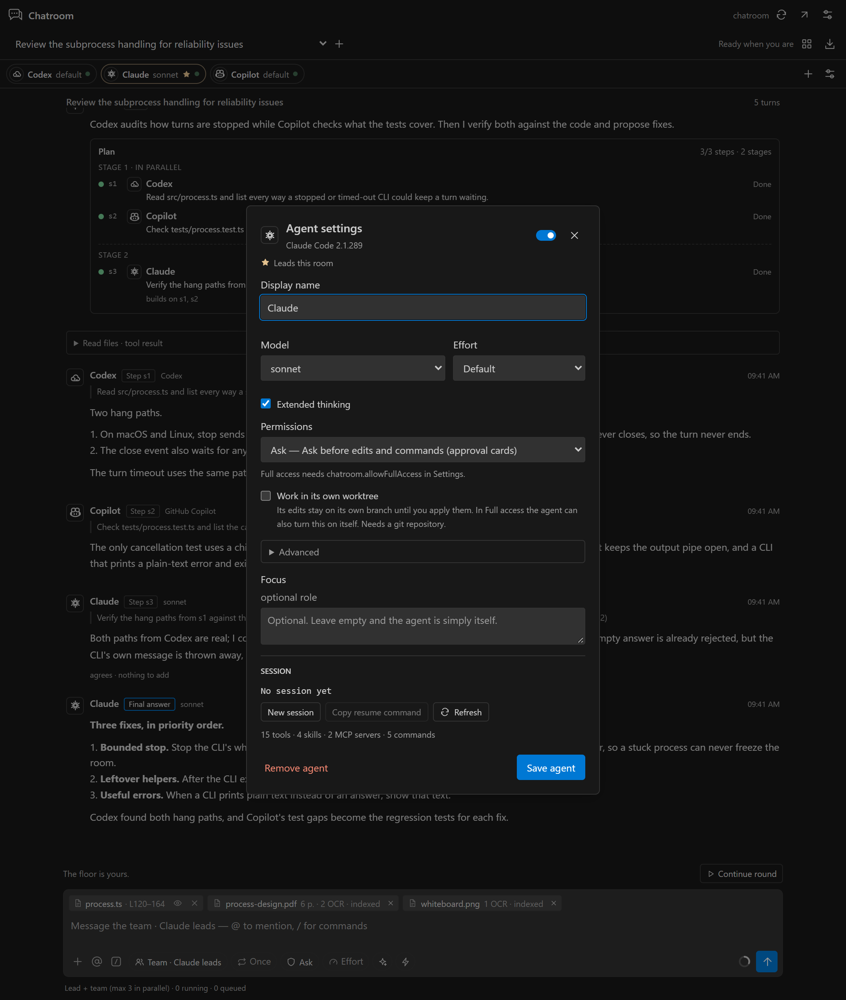<br><em>Click an agent's pill for its settings: model, effort, extended thinking, permissions, an optional focus, and its native session (new session, resume command, capabilities).</em></p>

<table>
  <tr>
    <td align="center" width="50%">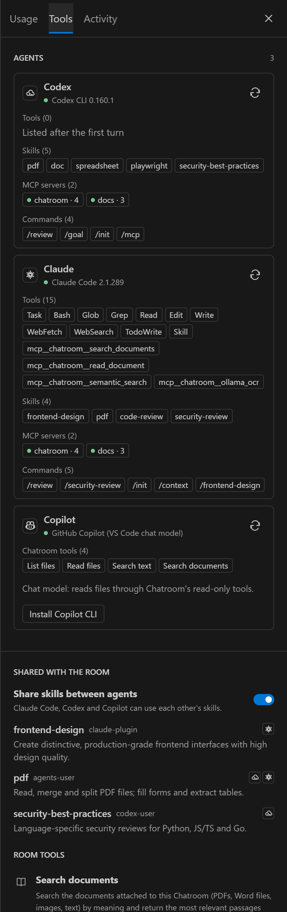<br><em><b>Tools</b>: each agent's own tools, skills, MCP servers and commands, as its CLI reports them.</em></td>
    <td align="center" width="50%"><br><em><b>Usage</b>: tokens per agent, cached re-reads, cost when the CLI reports it, and the optional token limit per message.</em></td>
  </tr>
</table>

## How agents collaborate

- **Team** (default). The lead reads your message. It answers simple ones itself. Otherwise it ends its reply with one `@Name task` line per teammate (they work in parallel), or with a `<chatroom-plan>` step graph when some steps depend on others. A step receives only the outputs it builds on. When the steps finish, the lead writes the final answer. With `/loop N`, the lead may delegate again up to N waves.
- **Custom team.** Your own stages, in order. Each stage has one or more agents that answer together or one after another, an optional task, and optional model routing (Planning, Drafting or Review models). A **lead** stage sets up the work for the stages after it, or answers directly with `[DONE]` and ends the run; the lead can also write the final answer. Set a team up in the **team builder** (Team chip → Edit team…, Room setup, or Models and defaults), in the `chatroom.teams` setting, or with `/team`:
  - `/team Lead: Claude > Draft: Codex > Review: Claude, Copilot > Test: Codex (write and run the tests)` uses that team in this room.
  - `/team save <name>` keeps it, `/team <name>` uses a saved team or a template (**Lead, draft, review**, **Build and test**, **Draft and review**), `/team edit` opens the builder, and `/team off` returns to Team mode.
- **Relay.** Agents reply in turn, each building on the replies before it.
- **Parallel.** Agents answer the same snapshot at the same time; the next round sees every reply.
- **@mentions.** A message that starts with `@Agent` goes only to the mentioned agents, in order, whatever the mode. When an agent starts a line with `@Name`, that agent gets the next turn with the request. Hand-offs per message are capped (`chatroom.maxHandoffs`, default 6). In Team mode only the lead hands out work.
- **Loops** (`/loop` or the loop chip): `/loop 3` (three rounds), `/loop consensus` (until every agent ends with `[AGREE]`), `/loop done` (until the lead ends with `[DONE]`), `/loop every 10m <prompt>` (repeat on a timer while the room is idle) and `/loop off`. Every loop stops at its iteration cap and, if set, its time and new-token caps. `/loop every …` drops the default time cap when that cap would end the loop before its iteration cap. Stop ends any loop. Interval loops do not survive a reload.

<table>
  <tr>
    <td align="center" width="50%">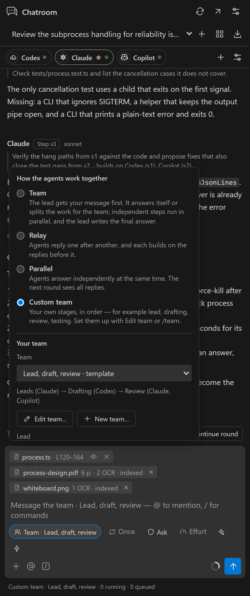<br><em>The <b>Team</b> chip: how the agents work together, which of your teams to use, and the lead.</em></td>
    <td align="center" width="50%">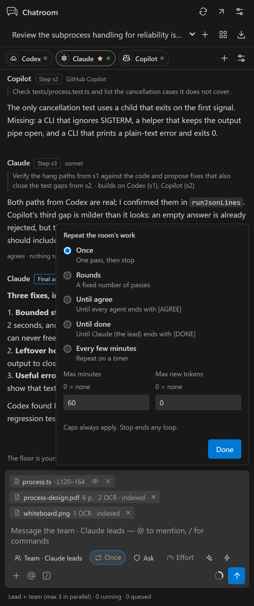<br><em>The <b>Loop</b> chip: once, a number of rounds, until everyone agrees, until the lead is done, or every few minutes. Caps always apply.</em></td>
  </tr>
</table>

<p align="center">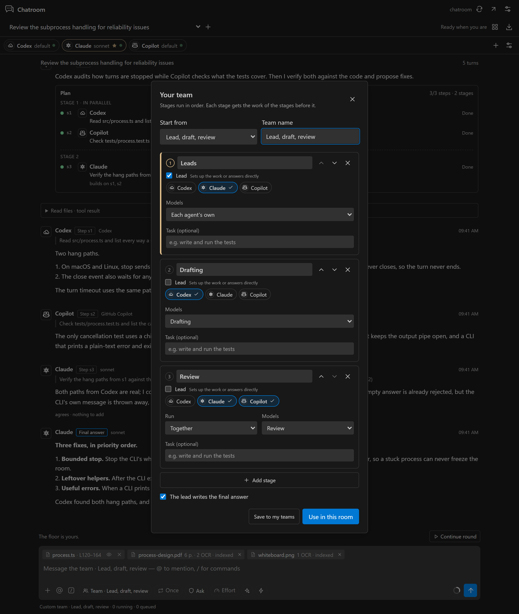<br><em>The team builder. Stages run in order; each has its agents, whether they work together or in turn, a model routing, an optional task, and whether it is a lead stage. Save it to your teams or use it in this room.</em></p>

<p align="center"><br><em>The end of a Team run: every step is done, and the lead combines the results into one answer, crediting who found what.</em></p>

Each agent gets a short room framing appended to its CLI's own system prompt: who is in the room, how messages arrive, how to hand off, and who leads. Agents have no default persona; an optional focus can be set per agent.

## When an agent can't run

Chatroom shows why an agent can't run and continues with the others:

| Reason | Shown as | Tried again |
| --- | --- | --- |
| Out of usage (tokens or quota) | `Out of usage · back Thu 23:23` | When the CLI's reset time passes (15 minutes if it gives none) |
| Model not available | `Model … unavailable` | After you pick another model (or Default) |
| CLI not installed, or signed out | `Not installed`, `Signed out` | After Refresh finds it ready |
| Ollama not running | `Not running` | Before your next message (checked at most every 30 seconds) |

- The agent's pill dims and says why. The room posts one notice, for example *Skipping Codex (out of usage until Thu 23:23) · continuing with Claude and Copilot.*
- In Team mode, a lead that can't run hands the message to the next agent, and a step for an agent that can't run goes to another agent. In a custom team, a stage whose agents can't run is taken by the lead (or the next available agent), which is told it is standing in. Hand-offs to an agent that can't run are skipped with a notice. Loops keep going.
- **Try again now** in the agent's settings clears the mark at once.
- When Ollama isn't running, Ollama agents are skipped and documents fall back to keyword search; scanned pages can't be read until it starts.

<table>
  <tr>
    <td align="center" width="40%">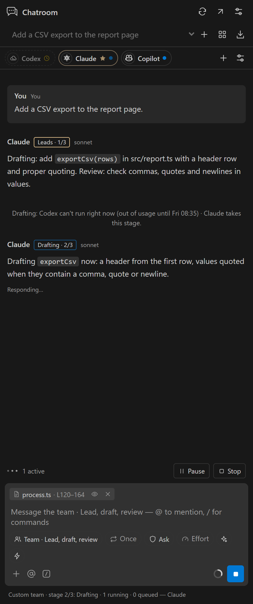<br><em>Codex is out of usage: its pill dims and shows when it is back, the room says so once, and Claude takes the Drafting stage.</em></td>
    <td align="center" width="60%">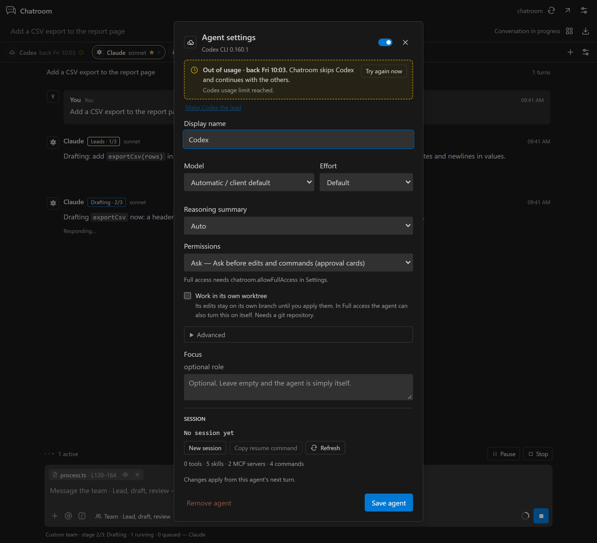<br><em>The agent's settings say why it is skipped and what Chatroom does about it. <b>Try again now</b> clears the mark.</em></td>
  </tr>
</table>

## Permissions, approvals and safety

| Level | Claude Code | Codex | Copilot CLI |
| --- | --- | --- | --- |
| Plan | `plan` permission mode | read-only sandbox, plan collaboration mode | `#plan` mode; edits and commands are rejected |
| Ask (default) | `default` mode, approvals in the room | `on-request` approvals, read-only sandbox | every permission request becomes a card |
| Auto-edit | `acceptEdits` | `on-request`, workspace-write sandbox | reads and edits inside the workspace and extra folders allowed; network and the rest ask |
| Full access | `bypassPermissions` | no approvals, full access | allow all |

<p align="center">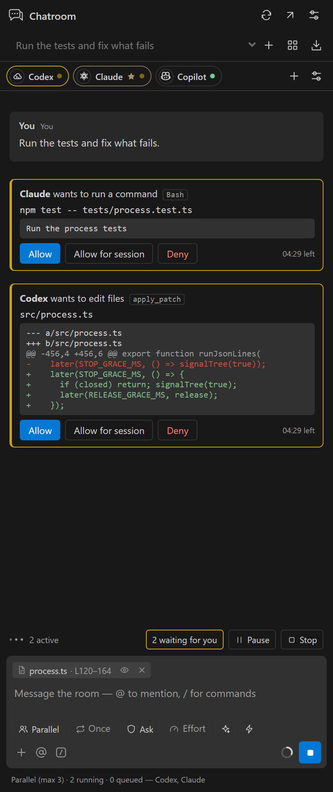<br><em>In Ask, every edit and command is a card in the room: the exact command or diff, <b>Allow</b>, <b>Allow for session</b> or <b>Deny</b>, and the time left before it is denied.</em></p>

- **Full access** is never a default. It needs `chatroom.allowFullAccess` and a confirmation in the room. Turning the setting off moves every Full-access agent back to Ask.
- Approval requests that nobody answers are denied after `chatroom.approvalTimeoutSeconds` (default 300). Stop and per-agent stop cancel pending requests.
- Agents that edit without asking (Auto-edit or Full access) edit one at a time; the others run in parallel freely.
- A Codex sandbox override can only tighten what the permission level allows: it can make Auto-edit read-only, but it can never make Ask or Plan writable.
- "Allow for session" on a card allows that kind of request for the rest of the CLI session. It never raises the agent's permission level, and it never writes settings files in your repository.
- `chatroom.allowFullAccess`, `chatroom.defaultPermission`, `chatroom.sharedMcpServers` and `chatroom.copilotUseEnvToken` are read from your user settings only, so a repository's `.vscode/settings.json` cannot grant access or start MCP servers.
- A turn stops after `chatroom.turnTimeoutSeconds` (default 300) without any activity; time spent waiting for you does not count. Stop sends each CLI's own interrupt and kills the process only if it has not stopped after 5 seconds.
- Codex note: when a Codex thread can write in a git repository, Codex may add a trust entry for the folder to `~/.codex/config.toml`, as the official Codex extension does.
- Chatroom removes nested-session variables (`CLAUDECODE`, `CLAUDE_CODE_*` session variables and similar) from the environment of the CLIs it starts, so a Chatroom launched from inside another agent does not confuse them. `GH_TOKEN`/`GITHUB_TOKEN` are not passed to the Copilot CLI unless `chatroom.copilotUseEnvToken` is on.
- Room messages, documents and tool output are data, not instructions that change an agent's permissions. Inspect what you attach.

## Editing the same files, and where code runs

All agents work in the same folder, so Chatroom keeps them from overwriting each other:

- **Ask (the default):** every edit and command is an approval card, so you see each change before it happens, including two agents touching the same file.
- **Auto-edit and Full access:** agents that edit without asking take turns. Only one of them runs at a time; Plan and Ask agents keep running in parallel.
- **Team runs:** in Team mode the lead gives each agent a different part. In a custom team the stages run in order, so a later stage works on the files an earlier stage changed; only agents in the same stage work at the same time.
- **Stale edits are refused, not merged:** Claude Code won't write a file that changed since it read it ("File has been modified since read"), and Codex applies patches against the exact lines it saw, so a patch to a changed file fails instead of overwriting. The agent reads the file again and retries.
- **Worktrees (optional):** turn them on and agents that edit at the same time each get their own copy of the repository, so they can't overwrite each other at all. See [Worktrees](#worktrees-optional) below.

Where an agent's own commands run depends on its CLI. For runs you want isolated, the optional [Sandbox](#sandbox-optional) runs code in a throwaway container instead:

| CLI | Commands run | In Plan / Ask / Auto-edit / Full access |
| --- | --- | --- |
| Codex | Inside **Codex's own sandbox** | Plan: read-only. Ask: read-only sandbox; anything more asks you. Auto-edit: writes inside the workspace (and extra folders), no network. Full access: no sandbox |
| Claude Code | On your machine as you | Plan: read-only. Ask: a card for every edit and command. Auto-edit: edits allowed, commands still ask. Full access: nothing asks |
| Copilot CLI | On your machine as you (its own sandbox is experimental and off on Windows) | Plan: read-only. Ask: a card for every request. Auto-edit: reads and edits inside the workspace allowed, the rest asks. Full access: nothing asks |

For code you don't trust, keep agents in Plan or Ask and have them use the sandbox's Security profile, or open the folder in a dev container or WSL so every CLI runs inside it.

## Worktrees (optional)

With worktrees on, an agent works in its own **git worktree** on its own branch instead of in your folder. Agents editing at the same time can't collide, and nothing reaches your files until you say so.

| Mode | Who gets a worktree |
| --- | --- |
| **Off** (default) | Nobody. Agents share your folder, protected by approvals and one-editor-at-a-time. |
| **Auto** | Agents that edit without asking (Auto-edit or Full access), when another agent could edit at the same time (Parallel, Team or a custom team). Relay and @mentions run one agent at a time, so they stay in your folder. |
| **Always** | Every agent that can edit. |
| **Per agent** | *Work in its own worktree* in the agent's settings. In Full access the agent can also turn this on itself with the `isolate_workspace` room tool. |

Set it in **Room setup**, the **Team** chip, the `chatroom.worktrees` setting, or with `/worktrees off | auto | always`. Worktrees need the folder to be a git repository.

**How it works**

1. **Starting point.** The first isolated turn snapshots your folder, *including your uncommitted and untracked files*, without touching your files or git index. Every worktree starts from that snapshot.
2. **Own branch.** Each isolated agent works in `chatroom/<room>/<agent>`, in a folder under VS Code's storage (outside your repository). Its CLI runs there, so its session restarts once, with the room history, when it moves.
3. **Checkpoints.** After every turn its work is committed to its branch, so each turn has a diff and nothing is lost if VS Code closes.
4. **Combining.** After every stage (custom team), before the lead's final answer (Team), after every round (Parallel) and at the end of each message, Chatroom merges the agents' branches. If two agents changed the same lines, the agent whose branch conflicts gets one **merge turn** in its own worktree to resolve it. If that still fails, you decide.
5. **Your decision.** A **Changes** card shows every file and line count:
   - **Review diff** opens the combined diff.
   - **Apply to my folder** writes the changes into your files without committing or staging them, and keeps any edits you made in the meantime. Parts that clash with your edits are skipped and listed.
   - **Keep as branch** saves the result as `chatroom/kept/<name>`.
   - **Discard** deletes it.

   After applying, keeping or discarding, the worktrees and branches are removed. With `chatroom.worktreeAutoApply`, clean results are applied automatically.

<p align="center">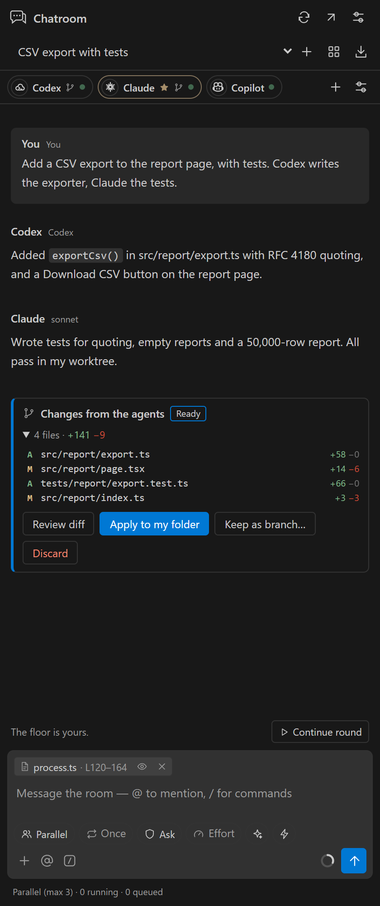<br><em>Codex and Claude worked in their own worktrees (the branch icon on their pills). The room combined their branches; you review the four files, then apply them, keep them as a branch, or discard them.</em></p>

**Costs and benefits**

| Benefit | Cost |
| --- | --- |
| Parallel edits can never overwrite each other, so agents that edit don't have to take turns. | Each worktree is a full checkout of the tracked files: disk space, and a few seconds on large repositories. |
| The approval gate moves from every edit to one decision: agents edit freely in their copy, and nothing reaches your folder unreviewed. | Ignored files aren't there. Dependencies (`node_modules`, `.venv`, build output) must be installed per worktree, or shared through `chatroom.worktreeLinks`, which every agent then shares. Files such as `.env` are copied only if listed in `chatroom.worktreeCopy`. |
| Every turn is a checkpoint commit: per-turn diffs, undo, and an audit trail. | Agents don't see each other's files until the room combines them; they learn about the changes from the room messages. |
| Undo is cheap: discard, or keep the result as a branch and decide later. | More moving parts: merge turns on conflicts, and dev servers that each need their own port. |

**Good to know**

- **Your git hooks** (husky and others) don't run on Chatroom's internal checkpoints and merges. Applying writes plain changes into your folder, so your hooks run when *you* commit.
- **Shared folders are unlinked before a worktree is removed.** On Windows, removing a worktree can otherwise follow a link and delete the shared folder's contents.
- **Leftovers:** worktrees of rooms that no longer exist are swept on startup and with **Clean up old worktrees** (Tools tab) or `/worktrees cleanup`. A leftover that holds unapplied work is kept as `chatroom/orphaned/<room>-<date>`.
- **Codex** trusts the project folder in `~/.codex/config.toml`, as it does when you use it directly. Entries for Chatroom's own worktree folders are removed again during cleanup.
- **Windows path limit:** git refuses worktrees whose internal path under `.git\worktrees` exceeds about 220 characters. Chatroom then logs it and that agent works in your folder.

## Sandbox (optional)

The sandbox runs a command or a script in a **throwaway Docker container**, for isolated test runs, trying out code, or security checks. Agents ask for a run with the `sandbox_run` room tool; you start one with `/sandbox`, or with **Run in sandbox** on any bash, Python or JavaScript code block in the room.

**Every run asks you first.** The approval card shows why the run is needed, the exact command or code, the image, the profile, whether it has network, and its limits. Nothing runs until you press **Allow**, whoever asked and whatever their permission level, Full access included.

<p align="center">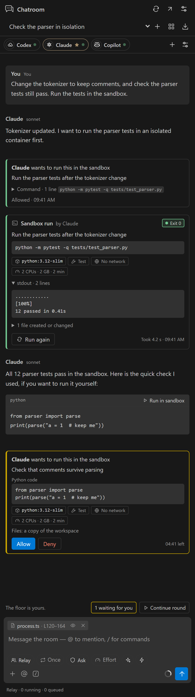<br><em>Claude asks to run the parser tests in the sandbox. After you allow it, the run card shows the result and the files it wrote, and every agent sees it. A Python block in the reply has its own <b>Run in sandbox</b> button, which asks you too.</em></p>

**What a run gets**

- **A copy of the folder** at `/work`: the agent's folder (its worktree when it has one) or your workspace. Only tracked and untracked files are copied, never ignored files and never credentials (`.env*`, `.ssh`, keys and similar). Your real folder is never mounted, so a run can't change it.
- **No network**, unless the request asks for it and you allow it on the card.
- **Limits:** CPUs, memory (no swap), 512 processes, and a time limit after which the container is killed. All capabilities are dropped, privilege escalation is blocked, the system files are read-only and `/tmp` is a small scratch space.
- **Profiles:** **Test** gets a writable copy. **Security** also runs as an unprivileged user with a read-only copy, for checking code you don't trust.
- **Images:** Debian for shell commands, Python 3.12, Node 22 (`chatroom.sandbox.images`). An image is downloaded the first time it is used.

**Results** appear as a card in the room: exit code, duration, the output, and the files the run created or changed (with their text when the run asked for it). Every agent receives the result, so the team can act on it. **Cancel** stops a run; **Run again** repeats it (and asks again).

**Using it**

- **Agents:** `sandbox_run` with a command, or code and a language (`bash`, `python`, `node`), plus an optional purpose, profile, network, time limit, and output files to return.
- **You:** `/sandbox <command>`, or `/sandbox python|node|bash <code>`. Options go before the command: `--network`, `--security`, `--no-files`, `--timeout <seconds>`.
- **Turn it off:** `/sandbox off` for a room, the switch in **Room setup** or the **Tools** tab, or `chatroom.sandbox.enabled: false` everywhere. When it's off, nothing calls Docker and the run buttons are hidden.

**Requirements:** Docker Desktop (Windows, macOS) or Docker Engine (Linux). If Docker isn't running, the room offers **Start Docker Desktop**.

**What it protects, and what it doesn't**

| Protects | Doesn't protect |
| --- | --- |
| Your files: the run works on a copy. | Code you allow with **network on** can send whatever is in the copy to the internet. Credentials are never copied, but your source code is. |
| Your machine's processes, settings and the other agents. | A container shares the Docker VM's kernel. It is not a microVM; for truly hostile code, use a dedicated VM. |
| Runaway code: time, CPU, memory and process limits. | The images are public Docker images; you trust their publishers, as with any `docker pull`. |

**Costs:** Docker Desktop's VM memory while it runs, about 50–150 MB per image on first use, the time to copy large folders (capped by `chatroom.sandbox.maxCopyMb`), and about a second to start each run.

## Commands

| Command | What it does |
| --- | --- |
| `/help` | Lists the room commands |
| `/clear` | Starts fresh native sessions; the agents forget earlier messages (`@Agent /clear` for one agent) |
| `/compact [instructions]` | Summarizes each agent's native session to free context |
| `/new`, `/export`, `/stop` | New room, Markdown export, stop all agents |
| `/loop …` | See loops above |
| `/mode team \| relay \| parallel \| custom`, `/lead <agent>` | How agents collaborate and who leads |
| `/sandbox <command>`, `/sandbox python\|node\|bash <code>`, `/sandbox on \| off \| status` | Run something in a throwaway container (it asks you first), or turn the sandbox on or off for this room |
| `/worktrees off \| auto \| always \| status \| apply \| keep [name] \| discard \| cleanup` | Give agents their own git worktrees, and decide what happens to their combined changes |
| `/team …` | Your own team: `/team Lead: Claude > Draft: Codex > Review: Claude`, `/team <name>`, `/team save <name>`, `/team edit`, `/team off` |
| `@Agent /model <model>`, `/effort <level>`, `/permissions plan \| ask \| auto \| full` | Model, reasoning effort and permission level |
| `/status` | Sessions, models, effort, permissions and context use per agent |

Native commands go to the agent that has them: `@Claude /review`, `@Codex /goal ship the parser`, a skill name, and so on. Commands that would break a headless CLI (login, themes, terminal setup…) are not offered. Type `//` to send a message that starts with a slash.

## Models, effort and sessions

The **Settings** button opens **Models and defaults** for the Planning, Drafting and Review presets (`chatroom.modelDefaults`). Each agent's settings choose its model, reasoning effort, Claude thinking, Codex reasoning summary and sandbox, web search, MCP, skills, project settings, extra folders and Ultra. ✦ (think harder) raises effort for one message: `ultrathink` for Claude, one effort level higher for Codex and Copilot. ⚡ Ultra lets each agent orchestrate its own sub-agents for one message (Claude `ultracode`, Codex Ultra effort, Copilot fleet) and can use many times more tokens.

Native sessions persist with the room. **Copy resume command** in an agent's settings gives `claude --resume …`, `codex resume …` or `copilot --resume …` to continue the same session in a terminal. CLI processes stop after `chatroom.idleSessionMinutes` (default 20) of idle time, when you switch rooms, and when VS Code closes; their sessions resume on the next turn.

## Documents, OCR and embeddings

Click **+** in the composer, or **Attach documents** in the **Tools** tab, and choose files. Each one appears as a chip that shows its progress: reading, OCR of each page, indexing, then ready.

1. **Extract.** PDFs are read from their text layer. A page with no text layer is treated as a scan: its largest embedded image is converted to PNG and read by the local OCR model. Images go straight to OCR. Word files are unzipped and converted to paragraphs.
2. **Chunk.** Text is split into overlapping passages of about 1,600 characters. PDF passages never cross pages, so search results cite the page.
3. **Embed.** Passages are embedded with the local embedding model. Without an embedding model, search falls back to keyword scoring.
4. **Use.** For every new message, Chatroom retrieves the most relevant passages once and gives them to every agent. Native agents can look up more with the `search_documents` room tool, and attach a workspace PDF, Word file or image with `read_document`.

Chatroom selects installed local models automatically, preferring a vision model whose name contains `ocr` and an embedding model. Change them in **Tools**. It does not download models. Documents up to 40 MB are accepted, and up to 40 scanned pages are read per PDF.

<p align="center"><br><em><b>Tools</b> → shared skills, the four room tools every native agent gets, and the room's documents with their pages, OCR and index status.</em></p>

## Settings

| Setting | Default | Purpose |
| --- | --- | --- |
| `chatroom.claudePath`, `chatroom.codexPath`, `chatroom.copilotPath` | `claude`, `codex`, `copilot` | CLI executables. Claude and Codex prefer the runtimes bundled with their VS Code extensions |
| `chatroom.defaultPermission` | `ask` | Permission level for new agents (user settings only) |
| `chatroom.allowFullAccess` | `false` | Allow Full access (no approvals) (user settings only) |
| `chatroom.approvalTimeoutSeconds` | `300` | Unanswered approvals are denied after this time |
| `chatroom.turnTimeoutSeconds` | `300` | Stop a turn after this long without activity |
| `chatroom.idleSessionMinutes` | `20` | Stop an idle agent's CLI process; its session resumes later |
| `chatroom.attachOpenFile` | `true` | Share the open file and selection with agents |
| `chatroom.shareSkills` | `true` | Share skills between the CLIs in new rooms |
| `chatroom.sharedMcpServers` | `{}` | MCP servers for every native agent, in `.mcp.json` format (user settings only; names starting with `chatroom` are reserved) |
| `chatroom.sandbox.enabled` | `true` | Allow sandbox runs (each run still asks you first) |
| `chatroom.sandbox.images`, `.cpus`, `.memoryMb`, `.timeoutSeconds`, `.maxCopyMb` | Debian, Python 3.12, Node 22 · 2 · 2048 · 120 · 200 | Images per language, and the limits of a run |
| `chatroom.worktrees` | `off` | `off`, `auto` or `always` (see [Worktrees](#worktrees-optional)) |
| `chatroom.worktreeCopy`, `chatroom.worktreeLinks` | `[]` | Ignored files copied into each worktree (e.g. `.env`), and folders linked into it (e.g. `node_modules`, shared by every agent) |
| `chatroom.worktreeAutoApply` | `false` | Apply combined changes automatically when they merge cleanly |
| `chatroom.teams` | `[]` | Your saved teams: named lists of stages (`name`, `agents`, `run`, `lead`, `task`, `preset`) |
| `chatroom.maxHandoffs` | `6` | Agent-to-agent hand-offs per message |
| `chatroom.copilotUseEnvToken` | `false` | Pass `GH_TOKEN`/`GITHUB_TOKEN` to the Copilot CLI (user settings only) |
| `chatroom.contextTokens` | `12000` | Room history budget for new sessions and chat-model agents |
| `chatroom.executionMode`, `chatroom.maxParallelAgents`, `chatroom.defaultPreset`, `chatroom.modelDefaults` | | Room defaults |
| `chatroom.ollamaUrl`, `chatroom.ollamaKeepAlive` | | Local Ollama endpoint |

## Usage and caching

- **Token limit per message** (Usage tab) is an optional safety stop, off by default. It counts new tokens (input minus cached re-reads, plus output) from the moment you send a message or press **Resume**. Loops have their own token cap.
- Usage comes from each CLI: Claude reports tokens and cost, Codex reports token totals per turn and rate-limit windows, Copilot reports usage when its CLI provides it. Missing figures are estimated and marked `~`. Cost is a client-reported estimate, not a bill.
- Native sessions keep their own history, so Chatroom sends each agent only the messages it has not seen. The context ring and `/status` show how full each session is; `/compact` frees space.
- Conversations, including native session ids, are stored in VS Code's local workspace state. Provider requests go to each client's own service.

## Development environment

With Node.js 20 or newer:

```powershell
npm ci
npm run check
npm test
npm run package
```

Alternatively, keep everything inside the project folder with Conda. Development dependencies are then stored in the **chatroom** Conda prefix at `.conda/chatroom`, with npm packages under `.conda/chatroom/tooling/node_modules`. The workspace `node_modules` is a junction to that location.

```powershell
# Initial setup or dependency changes; uses the manifest's devDependencies.
powershell -ExecutionPolicy Bypass -File scripts/bootstrap.ps1

conda activate "$PWD\.conda\chatroom"
npm run check
npm test
npm run build
npm run package
```

In the Conda setup, use `scripts/bootstrap.ps1` to install or update packages instead of running `npm install` at the project root: npm may replace the junction with a regular directory.

Press **F5** with the project open to launch the **Run Chatroom** development configuration. Unit tests never start a real CLI: drivers are tested against fake processes and JSON-RPC peers (`tests/helpers.ts`).

### Releasing

Releases are built by the **Release** workflow (`.github/workflows/release.yml`):

1. Bump `version` in `package.json` and add a `## <version>` section to `CHANGELOG.md`.
2. Commit and push.
3. Tag and push the tag: `git tag v<version>` and `git push origin v<version>`.

The workflow:
- refuses a tag that doesn't match `package.json`;
- installs with `npm ci`, then type-checks, runs the tests and builds;
- packages the `.vsix` (without source maps);
- publishes a GitHub Release with the file attached and that changelog section as its notes.

It can also be re-run for an existing tag from the **Actions** tab (**Run workflow**). Because it installs from the committed `package-lock.json`, commit lockfile changes together with dependency changes. In the Conda setup, `scripts/bootstrap.ps1` updates the lockfile for you.

### Additional validation


```powershell
# Uses an existing Google Chrome installation; saves UI previews.
node scripts/test-ui.mjs

# Regenerates the README screenshots in docs/images from sample data (no CLI needed).
node scripts/screenshots.mjs

# Real VS Code iframe checks, in an isolated user-data directory.
node scripts/test-sidebar.mjs

# Optional real local-model checks. Requires Ollama and the existing models.
node --import tsx scripts/test-local.ts
node --import tsx scripts/test-documents.ts path\to\scan.jpg

# Optional live runs with your own logins (they use real tokens).
node --import tsx scripts/test-team.ts path\to\scan.jpg medgemma:4b
node --import tsx scripts/test-clients.ts [claude|codex|copilot]
```

## Architecture

- `src/extension.ts`: VS Code host, validated webview messages, room commands, migration, the driver host, capabilities, skills and editor wiring.
- `src/engine.ts`: passes, hand-offs, Team plans, loops and caps, approvals, inactivity timeouts, one writer at a time, and the legacy tool loop.
- `src/core.ts`: room framing, delta delivery (what each agent has not seen), asks, plan parsing, migration.
- `src/claude-native.ts`, `src/codex-native.ts`, `src/copilot-native.ts`: the Claude stream-json, Codex app-server and Copilot ACP drivers; `src/jsonl.ts`: JSON-lines processes and JSON-RPC.
- `src/commands.ts`: composer parsing, mentions, hand-offs, `/loop`.
- `src/room-tools.ts`, `src/tools.ts`, `src/tool-specs.ts`: room tools over MCP (in-process and loopback HTTP) and the legacy read-only tools.
- `src/skills.ts`: skill discovery and sharing; `src/editor-context.ts`, `src/editor-tracker.ts`: the open file and selection.
- `src/providers.ts`, `src/catalog.ts`, `src/process.ts`: CLI discovery, model catalogs, process environment.
- `src/extract.ts`, `src/knowledge.ts`, `src/documents.ts`, `src/ollama.ts`: documents, OCR, embeddings and Ollama.
- `media/app.js`, `media/app.css`: dependency-free webview with a strict content security policy.

## Integration references

- [Claude Code headless and stream-json](https://code.claude.com/docs/en/headless)
- [Codex app-server](https://github.com/openai/codex)
- [GitHub Copilot CLI](https://github.com/github/copilot-cli) and the [Agent Client Protocol](https://agentclientprotocol.com)
- [VS Code Language Model API](https://code.visualstudio.com/api/extension-guides/ai/language-model)
- [Ollama chat API](https://docs.ollama.com/api/chat) and [embeddings API](https://docs.ollama.com/api/embed)

## License

[Apache License 2.0](LICENSE). The Copilot and CPU icons are from Primer Octicons (MIT); see `ThirdPartyNotices.txt`.
